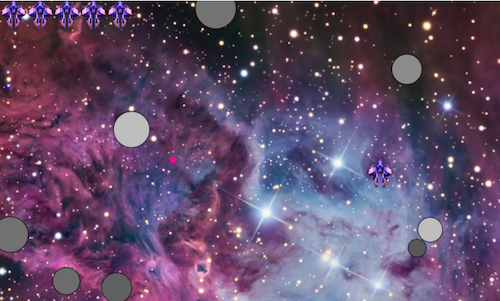

# Asteroids.js
Asteroids written in Javascript and rendered on the HTML5 canvas.  Play it [here](http://ndevvy.github.io/asteroids)!

## Code highlights / notes
* **Class Inheritance**: I wrote an `inherits` function using the surrogate method to handle prototypal class inheritance. The `Surrogate` lets temporarily assign the `ParentClass` prototype which can then be passed on to the `ChildClass`. This ensures that the `ChildClass`'s methods don't get inherited in the wrong direction by the `ParentClass`.

````javascript
Asteroids.Util.inherits = function(ChildClass, ParentClass) {
  var Surrogate = function () {};
  Surrogate.prototype = ParentClass.prototype;
  ChildClass.prototype = new Surrogate();
  ChildClass.prototype.constructor = ChildClass;
};
````

* **Movement**: The ship stores its direction as a unit vector; powering the ship multiplies the ship's velocity by same:

````javascript
Ship.prototype.power = function(impulse) {
  var impulseVector = [this.direction[0] * impulse * Ship.VEL_MOD, this.direction[1] * impulse * Ship.VEL_MOD];
  this.vel[0] += impulseVector[0];
  this.vel[1] += impulseVector[1];
};
````

* Drawing **rotated images** on the Canvas:

````javascript
Ship.prototype.draw = function(ctx) {
  var rad = this.rotation * (Math.PI / 180.0);
  ctx.save();
  ctx.translate(this.pos[0], this.pos[1]);
  ctx.rotate(rad);
  ctx.drawImage(Ship.IMG, -(Ship.IMG.width/2), -(Ship.IMG.height/2));
  ctx.restore();
};
````

## To do / forthcoming
- [x] Add levels/infinite play
- [x] Add score
- [ ] Splash screen with instructions and start button
- [ ] Replay button
- [ ] Local high score
- [ ] Make asteroids break apart
- [ ] Make asteroids different shapes
- [ ] Power-ups / extra lives
- [ ] Make asteroids rotate as they move
- [ ] Sound effects / music
- [ ] Run on Rails app and persist high scores
